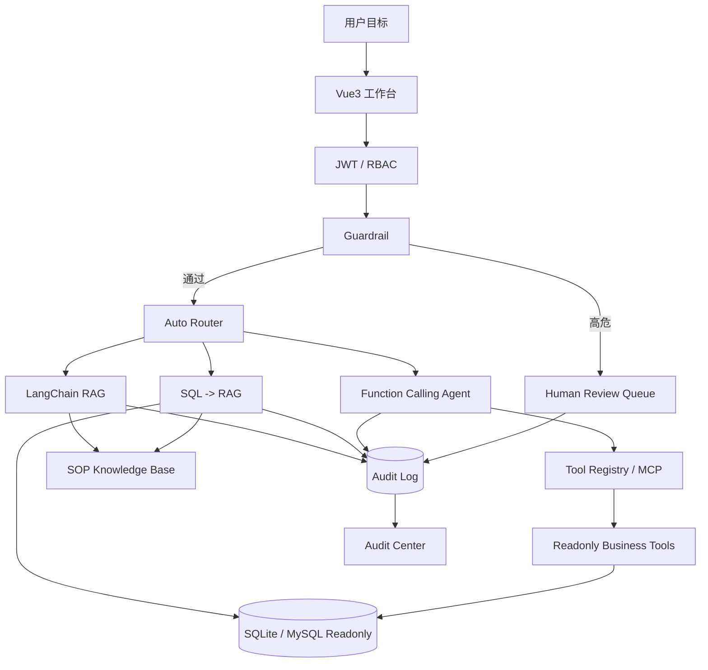

# 企业级智能客诉预警与数据洞察 Copilot 求职版

这是一个面向 AI 应用 / Agent / 全栈 AI 工程岗位的求职项目。项目重点不是“接一个大模型聊天框”，而是把 AI 放进真实业务处理链路里：权限、路由、工具调用、只读数据查询、RAG 证据、高危拦截、人工复核、审计和成本追踪。

## 投递定位

| 岗位 | 简历重点 |
| --- | --- |
| AI 应用工程师 | Function Calling、RAG、Guardrail、评测、token/cost |
| Agent 工程师 | Router、Tool Registry、MCP stdio server、LangGraph、Human-in-the-loop |
| 全栈 AI 工程师 | Vue3 工作台、FastAPI API、SSE、E2E、Docker |
| Python 后端工程师 | FastAPI、JWT/RBAC、只读 SQL、审计、pytest |
| 数据应用工程师 | 客诉指标、异常明细、SOP 依据、复核闭环 |

## 作品集入口

推荐面试演示地址：

```text
http://127.0.0.1:4261
```

页面说明：

```text
/public   公开项目页，用于简历或投递链接
/login    登录页
/         今日作战台
/copilot  处理工作台，包含 Agent 执行链路和证据栏
/audit    审计中心
/eval     评测报告
/review   主管审批中心
```

旧静态页保留在 `/legacy` 和 `/legacy-review`，不是主展示入口。

## 已实现能力

- `Vue3 生产前端`：公开页、登录页、今日作战台、处理工作台、审计中心、审批中心。
- `Agent 执行链路可视化`：权限、Guardrail、Router、工具/RAG、人工复核、审计都在前端可见。
- `JWT / RBAC`：viewer、analyst、supervisor 三种角色，前端路由和后端接口均有限权。
- `Auto Router`：自动把问题分发到 Function Calling、LangChain RAG、SQL + RAG 或 Guardrail。
- `Tool Registry / MCP`：统一登记订单、物流、退款资格、市场政策、风险和 SOP 检索工具，支持 HTTP JSON-RPC 和 stdio MCP server。
- `只读 SQL`：模型不直接执行 SQL，后端工具层生成参数化查询和 SQL preview。
- `SOP RAG`：返回 citation、retrieval score、rerank score；无 API key 时可 fallback。
- `SQL + RAG`：先查异常明细，再结合 SOP 给出升级判断。
- `Guardrail`：拦截退款、改单、删除、导出用户、prompt injection 等高危请求。
- `Human Review`：高危或证据不足请求进入主管复核队列。
- `Audit Center`：展示 request_id、trace_id、route、tool trace、SQL、latency、retry、token/cost。
- `Eval Report`：展示 50 case route、tool、RAG citation、Guardrail、memory follow-up 指标。
- `工程化验收`：pytest、Playwright 桌面/移动端 E2E、50 case eval、GitHub Actions、Dockerfile、Render 部署蓝图、demo GIF。

## 架构图



## 本地启动

首次准备：

```powershell
python -m pip install -r requirements.txt
cd frontend
npm install
npm run build
cd ..
```

单端口演示：

```powershell
$env:AUTH_ENFORCED="true"
$env:REDIS_ENABLED="false"
$env:DATA_QUERY_BACKEND="sqlite"
$env:USE_LANGCHAIN_RAG="false"
python -m uvicorn main:app --host 127.0.0.1 --port 4261
```

开发模式：

```powershell
node scripts\start_real_dev.js
```

演示账号：

```text
viewer@example.com / Viewer@123
analyst@example.com / Analyst@123
supervisor@example.com / Supervisor@123
```

## 求职演示顺序

1. 打开 `/public`：一句话说明“这是受控 Agent 工作台，不是聊天框”。
2. 登录 analyst：展示今日作战台、优先队列和演示路径。
3. 进入 `/copilot`：输入“质量问题退款超过100元的明细，按 SOP 是否需要主管复核”。
4. 展示主回答：SQL 预览、异常明细、SOP citation、Agent 执行链路、token/cost。
5. 输入“直接退款并改订单”：展示 Guardrail 拦截和 review case。
6. 进入 `/audit`：展示 request_id、route、tool trace、latency、cost。
7. 进入 `/eval`：展示 route/tool/RAG/Guardrail/memory 评测指标。
8. 切换 supervisor：进入 `/review`，处理待复核单。

详细讲稿见：

```text
docs/demo_script.md
docs/interview_guide.md
docs/ai_agent_job_hunting_guide_for_beginner.md
docs/mcp_server.md
docs/deployment_ci.md
deploy/README.md
```

## 简历描述

企业级智能客诉预警与数据洞察 Copilot：

> 面向客服主管和运营分析场景，构建一个可进行自然语言数据查询、售后 SOP 检索、高风险操作拦截、人工复核和审计追踪的 AI Agent 工作台原型。项目基于 FastAPI、Vue3、Function Calling、Tool Registry / MCP、LangChain RAG、LangGraph、SQLite/MySQL 只读查询、JWT/RBAC 和 Guardrail 实现，并返回 SQL preview、citation、Tool Trace、token usage、cost breakdown 和 review case。

推荐 bullet：

- 基于 FastAPI + Vue3 构建企业客诉 Copilot 工作台，支持登录、角色权限、自然语言查询、异常明细展示、审计中心和人工复核流程。
- 设计 Auto Router，将用户问题分发到 Function Calling、LangChain RAG、SQL + RAG 或 Guardrail，提升回答结构化与可追溯性。
- 建立 Tool Registry / MCP 工具层，将订单、物流、退款资格、市场政策、风险和 SOP 检索封装为统一只读工具，并通过 `/api/mcp` 与 stdio MCP server 暴露 `tools/list`、`tools/call`，调用前执行 RBAC 和参数校验。
- 实现 SQLite/MySQL 只读查询层与 SQL 安全校验，禁止模型直接执行任意 SQL，工具层通过参数化查询返回指标、明细、SQL preview 和 Tool Trace。
- 构建 SOP RAG 与 SQL + RAG 复合推理链路，基于 citation、retrieval score、rerank score 和明细摘要生成可追溯回答。
- 建立 Agent 治理能力，包括 Guardrail、高危请求拦截、human-in-the-loop 复核队列、反馈事件、审计日志、trace_id、retry_count、token usage 和 cost breakdown。
- 搭建工程化验收体系，使用 pytest、Playwright 桌面/移动端 E2E、50 case eval、GitHub Actions CI、Docker build、Render 部署蓝图和自动截图/GIF 脚本覆盖核心演示路径。

## 30 秒面试讲法

> 我做了一个企业级智能客诉 Copilot，用户可以用自然语言查询异常退款、订单物流、售后 SOP 和用户风险。系统通过 Auto Router 判断该走数据查询、政策检索还是 SQL + RAG 复合链路；数据查询由 Tool Registry 统一登记的 Function Calling 工具和只读 SQL 层完成，政策回答由 RAG 返回引用来源和分数。为了避免 Agent 越权，我加了 JWT/RBAC、Guardrail、只读 SQL 校验、审计日志和人工复核队列。前端用 Vue3 做成工作台，包含今日优先级、处理台、Agent 执行链路、审计中心和复核中心，并补了 pytest、Playwright E2E、50 case eval、CI、Docker 和 demo GIF。

## 验证结果

```text
python -m py_compile app\runtime.py main.py: passed
python -m pytest -q: 43 passed
frontend npm run build: passed
npm run test:e2e: 3 passed
node scripts\capture_demo.js: passed
```

Docker 镜像构建需要本机 Docker Desktop 可用。当前代码保留 Dockerfile 与 CI job，Docker 可用后运行：

```powershell
docker build -t complaint-copilot:ci .
docker compose up --build
```

## 边界说明

- 当前是求职展示级原型，不是完整生产系统。
- 当前不会真实退款、改单、删除或导出用户，只会拦截并生成复核单。
- 当前已补 stdio MCP server；streamable HTTP、企业网关鉴权和工具级灰度发布仍是后续生产化增强。
- 当前 SQLite 是本地样本库，MySQL 只读路径用于说明生产接入方式。
- 当前 RAG 支持 Chroma 和 fallback；真实线上检索需要配置 embedding key 并构建向量库。
